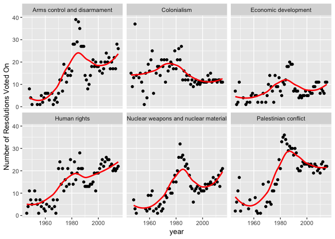
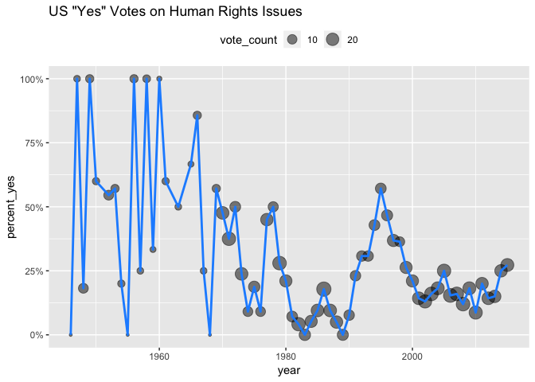
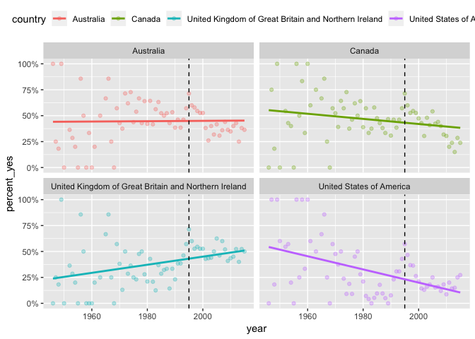
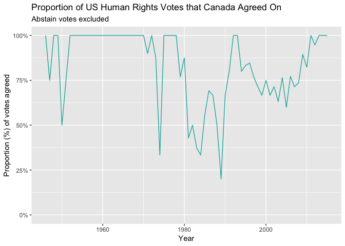
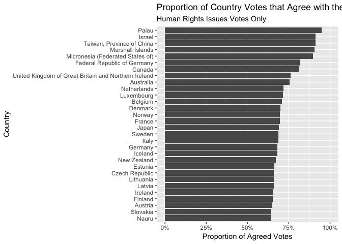
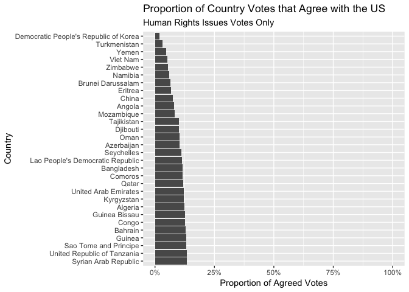
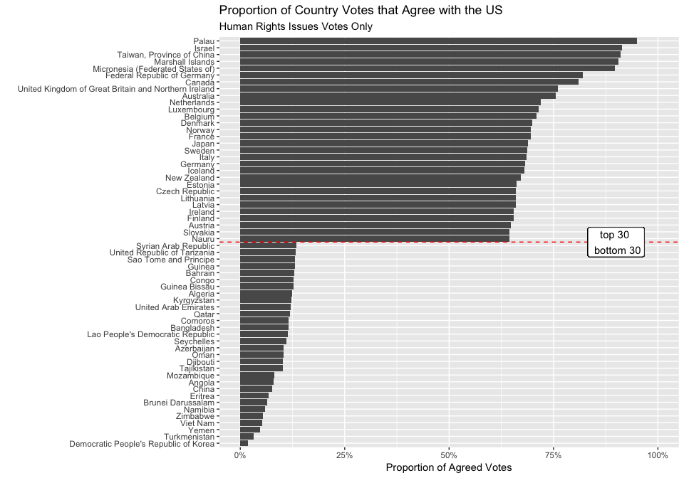
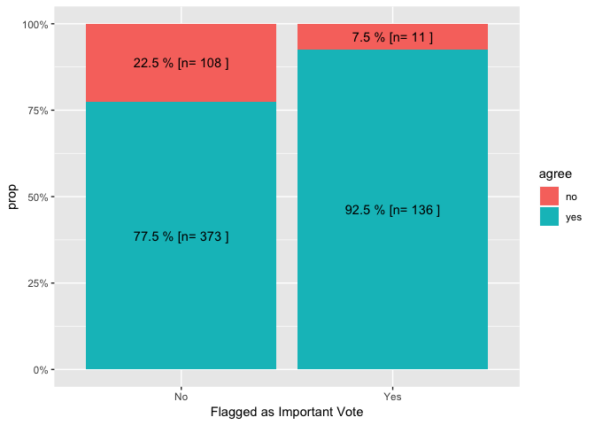
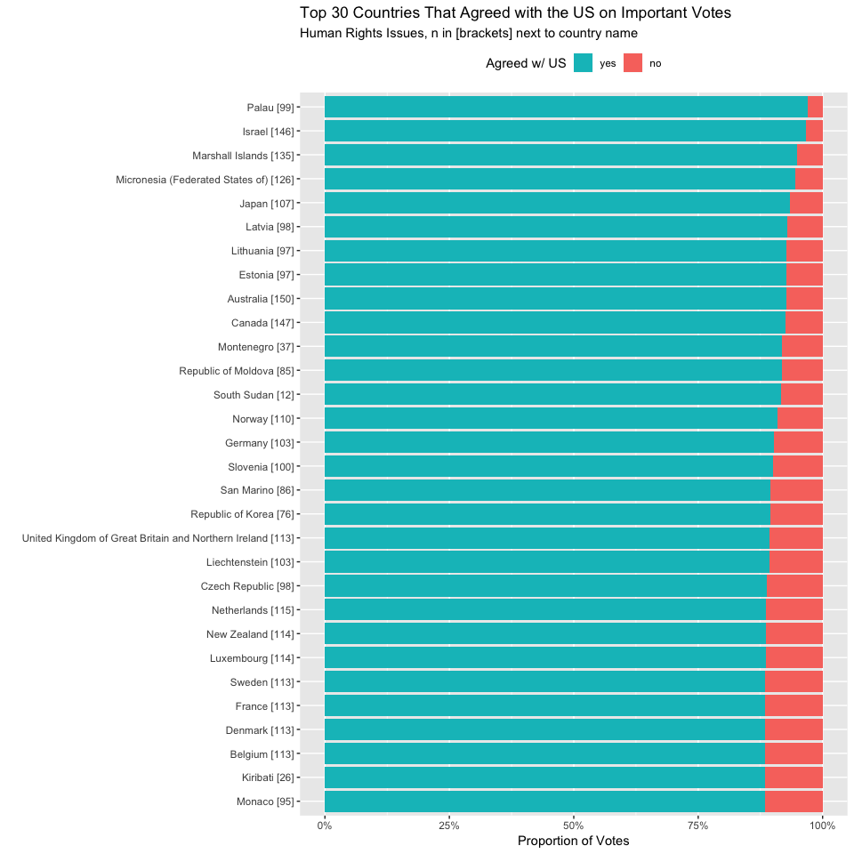

UN Votes - Data Wrangling & Exploration in R
================
Nancy Huynh
2018-12-10

-   [UN Votes](#un-votes)
    -   [Data Imports and Libraries](#data-imports-and-libraries)
    -   [Initial Data Exploration](#initial-data-exploration)
        -   [How many roll call votes did each type of issue get?](#how-many-roll-call-votes-did-each-type-of-issue-get)
        -   [How many resolutions did each type of issue get over the years?](#how-many-resolutions-did-each-type-of-issue-get-over-the-years)
        -   [What proportion of yes/no/abstain votes were received per issue type?](#what-proportion-of-yesnoabstain-votes-were-received-per-issue-type)
    -   [Deeper Dive into Human Rights](#deeper-dive-into-human-rights)
        -   [Which country(ies) had the lowest proportion of yes votes on Human Rights issues?](#which-countryies-had-the-lowest-proportion-of-yes-votes-on-human-rights-issues)
        -   [How has the US "yes" votes on Human Rights issues changed over time?](#how-has-the-us-yes-votes-on-human-rights-issues-changed-over-time)
        -   [How does the United States "yes" votes on Human Rights compare to other countries over the years?](#how-does-the-united-states-yes-votes-on-human-rights-compare-to-other-countries-over-the-years)
        -   [What proportion of the US' Human Rights votes did Canada agree with over time?](#what-proportion-of-the-us-human-rights-votes-did-canada-agree-with-over-time)
        -   [Which countries' votes agree with the US most often on Human Rights?](#which-countries-votes-agree-with-the-us-most-often-on-human-rights)
        -   [The countries that agreed with the US least often on Human Rights?](#the-countries-that-agreed-with-the-us-least-often-on-human-rights)
        -   [Did Canada and the US' agreeableness on Human Rights differ for important votes?](#did-canada-and-the-us-agreeableness-on-human-rights-differ-for-important-votes)
        -   [Which countries agreed with the US the most on important Human Rights votes?](#which-countries-agreed-with-the-us-the-most-on-important-human-rights-votes)
    -   [Final Thoughts](#final-thoughts)

UN Votes
========

While working my way through the courses for Datacamp's Data Analyst Track I completed a course that introduced me to the UN Votes data set found in this the `unvotes` [package](https://cran.r-project.org/web/packages/unvotes/). It seemed like an interesting and perfect data set to wrangle, analyse, and extend what I learned in the Data Analyst Track.

Data Imports and Libraries
--------------------------

``` r
#LOAD LIBRARIES
library(tidyverse)
library(lubridate)
library(scales)

library(unvotes) #for the UN Votes data
```

Initial Data Exploration
------------------------

United Nations General Assembly Voting Data package (unvotes) contains three tables of data. `un_votes` contains data on each country's vote on roll calls (rcid). 738764 votes are recorded in the dataset.

``` r
head(un_votes)
```

    ## # A tibble: 6 x 4
    ##    rcid country                  country_code vote 
    ##   <int> <chr>                    <chr>        <fct>
    ## 1     3 United States of America US           yes  
    ## 2     3 Canada                   CA           no   
    ## 3     3 Cuba                     CU           yes  
    ## 4     3 Haiti                    HT           yes  
    ## 5     3 Dominican Republic       DO           yes  
    ## 6     3 Mexico                   MX           yes

``` r
str(un_votes)
```

    ## Classes 'tbl_df', 'tbl' and 'data.frame':    738764 obs. of  4 variables:
    ##  $ rcid        : int  3 3 3 3 3 3 3 3 3 3 ...
    ##   ..- attr(*, "comment")= chr ""
    ##  $ country     : chr  "United States of America" "Canada" "Cuba" "Haiti" ...
    ##  $ country_code: chr  "US" "CA" "CU" "HT" ...
    ##  $ vote        : Factor w/ 3 levels "yes","abstain",..: 1 3 1 1 1 1 1 1 1 1 ...

`un_roll_call_issues` contains information on each roll call vote (rcid) issue, specifically one of six types of issue (Palestinian conflict, Colonialism, Human rights, Arms control an disarmament, Nuclear weapons and nuclear material, and Economic development)

``` r
head(un_roll_call_issues)
```

    ## # A tibble: 6 x 3
    ##    rcid short_name issue               
    ##   <int> <chr>      <chr>               
    ## 1  3372 me         Palestinian conflict
    ## 2  3658 me         Palestinian conflict
    ## 3  3692 me         Palestinian conflict
    ## 4  2901 me         Palestinian conflict
    ## 5  3020 me         Palestinian conflict
    ## 6  3217 me         Palestinian conflict

``` r
str(un_roll_call_issues)
```

    ## Classes 'tbl_df', 'tbl' and 'data.frame':    5281 obs. of  3 variables:
    ##  $ rcid      : int  3372 3658 3692 2901 3020 3217 3298 3429 3558 3625 ...
    ##  $ short_name: chr  "me" "me" "me" "me" ...
    ##  $ issue     : chr  "Palestinian conflict" "Palestinian conflict" "Palestinian conflict" "Palestinian conflict" ...

`un_roll_calls` contains data of information about each roll call vote (rcid), including session, date, description, and relevant resolution that was voted on

``` r
head(un_roll_calls)
```

    ## # A tibble: 6 x 9
    ##    rcid session importantvote date       unres  amend  para short  descr   
    ##   <int>   <dbl>         <dbl> <date>     <chr>  <dbl> <dbl> <chr>  <chr>   
    ## 1     3       1             0 1946-01-01 R/1/66     1     0 AMEND… TO ADOP…
    ## 2     4       1             0 1946-01-02 R/1/79     0     0 SECUR… TO ADOP…
    ## 3     5       1             0 1946-01-04 R/1/98     0     0 VOTIN… "TO ADO…
    ## 4     6       1             0 1946-01-04 R/1/1…     0     0 DECLA… TO ADOP…
    ## 5     7       1             0 1946-01-02 R/1/2…     1     0 GENER… "TO ADO…
    ## 6     8       1             0 1946-01-05 R/1/2…     1     0 ECOSO… TO ADOP…

``` r
str(un_roll_calls)
```

    ## Classes 'tbl_df', 'tbl' and 'data.frame':    5429 obs. of  9 variables:
    ##  $ rcid         : int  3 4 5 6 7 8 9 10 11 12 ...
    ##  $ session      : num  1 1 1 1 1 1 1 1 1 1 ...
    ##  $ importantvote: num  0 0 0 0 0 0 0 0 0 0 ...
    ##  $ date         : Date, format: "1946-01-01" "1946-01-02" ...
    ##  $ unres        : chr  "R/1/66" "R/1/79" "R/1/98" "R/1/107" ...
    ##  $ amend        : num  1 0 0 0 1 1 0 1 0 1 ...
    ##  $ para         : num  0 0 0 0 0 0 0 1 0 1 ...
    ##  $ short        : chr  "AMENDMENTS, RULES OF PROCEDURE" "SECURITY COUNCIL ELECTIONS" "VOTING PROCEDURE" "DECLARATION OF HUMAN RIGHTS" ...
    ##  $ descr        : chr  "TO ADOPT A CUBAN AMENDMENT TO THE UK PROPOSAL REFERRING THE PROVISIONAL RULES OF PROCEDURE AND ANY AMENDMENTS T"| __truncated__ "TO ADOPT A USSR PROPOSAL ADJOURNING DEBATE ON AND POSTPONINGELECTIONS OF THE NON-PERMANENT MEMBERS OF THE SECUR"| __truncated__ "TO ADOPT THE KOREAN PROPOSAL THAT INVALID BALLOTS BE INCLUDED IN THE TOTAL NUMBER OF \\MEMBERS PRESENT AND VOTI"| __truncated__ "TO ADOPT A CUBAN PROPOSAL (A/3-C) THAT AN ITEM ON A DECLARATION OF THE RIGHTS AND DUTIES OF MAN BE TABLED." ...

### How many roll call votes did each type of issue get?

``` r
un_roll_call_issues %>% 
  count(issue, sort = TRUE)
```

    ## # A tibble: 6 x 2
    ##   issue                                    n
    ##   <chr>                                <int>
    ## 1 Palestinian conflict                  1104
    ## 2 Colonialism                            991
    ## 3 Human rights                           986
    ## 4 Arms control and disarmament           956
    ## 5 Nuclear weapons and nuclear material   762
    ## 6 Economic development                   482

### How many resolutions did each type of issue get over the years?

Note that a number of issues were not categorized under the 6 types of issues

``` r
by_year_topic <- un_roll_calls %>% 
  left_join(un_roll_call_issues, by = "rcid") %>%
  mutate(year = year(date)) %>%
  filter(!is.na(issue)) %>% # filter out the ones that were not categorized
  group_by(year, issue) %>%
  count()

head(by_year_topic, 20)
```

    ## # A tibble: 20 x 3
    ## # Groups:   year, issue [20]
    ##     year issue                                    n
    ##    <dbl> <chr>                                <int>
    ##  1  1946 Colonialism                             15
    ##  2  1946 Economic development                     7
    ##  3  1946 Human rights                             1
    ##  4  1946 Palestinian conflict                     2
    ##  5  1947 Colonialism                              9
    ##  6  1947 Economic development                     1
    ##  7  1947 Human rights                             4
    ##  8  1947 Palestinian conflict                     6
    ##  9  1948 Arms control and disarmament             8
    ## 10  1948 Colonialism                             13
    ## 11  1948 Economic development                     2
    ## 12  1948 Human rights                            11
    ## 13  1948 Nuclear weapons and nuclear material     7
    ## 14  1948 Palestinian conflict                    11
    ## 15  1949 Arms control and disarmament             4
    ## 16  1949 Colonialism                             37
    ## 17  1949 Economic development                    11
    ## 18  1949 Human rights                             7
    ## 19  1949 Nuclear weapons and nuclear material     3
    ## 20  1949 Palestinian conflict                    17

Let's see how the number of resolutions changed over the years

``` r
by_year_topic %>%
  ggplot(aes(x = year, y = n)) +
  geom_point() +
  geom_smooth(se = FALSE, color = "red") +
  facet_wrap(~ issue) +
  ylab("Number of Resolutions Voted On")
```

    ## `geom_smooth()` using method = 'loess' and formula 'y ~ x'



### What proportion of yes/no/abstain votes were received per issue type?

``` r
un_votes %>% 
  inner_join(un_roll_call_issues, by = "rcid") %>%
  group_by(issue) %>%
  summarize(vote_count = n(), 
            percent_yes = mean(vote == "yes"),
            percent_no = mean(vote == "no"),
            percent_abstain = mean(vote == "abstain")) %>%
  arrange(percent_yes)
```

    ## # A tibble: 6 x 5
    ##   issue                   vote_count percent_yes percent_no percent_abstain
    ##   <chr>                        <int>       <dbl>      <dbl>           <dbl>
    ## 1 Human rights                146441       0.751     0.0871           0.162
    ## 2 Colonialism                 127027       0.801     0.0663           0.133
    ## 3 Nuclear weapons and nu…     115266       0.810     0.0666           0.123
    ## 4 Economic development         68828       0.827     0.0539           0.119
    ## 5 Arms control and disar…     146581       0.829     0.0571           0.114
    ## 6 Palestinian conflict        164531       0.839     0.0454           0.116

Deeper Dive into Human Rights
-----------------------------

Did you notice that the percent of yes votes for Human Rights issues is a bit lower compared to the others? 75%, compared to ~ 80% for the other issues. I looked further into these issues to see how agreeable countries were on Human Rights issues.

### Which country(ies) had the lowest proportion of yes votes on Human Rights issues?

The US isn't very agreeable! Although it isn't the most unagreeable, that goes to Palau.

``` r
hr_country_votes <- un_votes %>%
  inner_join(un_roll_call_issues, by = "rcid") %>%
  filter(short_name == "hr") %>%
  group_by(country) %>%
  summarize(vote_count = n(),
            percent_yes = mean(vote == "yes"),
            percent_no = mean(vote == "no"),
            percent_abstain = mean(vote == "abstain")) 

head(arrange(hr_country_votes, percent_yes), 10)
```

    ## # A tibble: 10 x 5
    ##    country                vote_count percent_yes percent_no percent_abstain
    ##    <chr>                       <int>       <dbl>      <dbl>           <dbl>
    ##  1 Palau                         324       0.244      0.627           0.130
    ##  2 United States of Amer…        979       0.253      0.584           0.162
    ##  3 Marshall Islands              461       0.310      0.482           0.208
    ##  4 Israel                        892       0.313      0.504           0.183
    ##  5 Micronesia (Federated…        422       0.334      0.457           0.209
    ##  6 Federal Republic of G…        319       0.339      0.157           0.505
    ##  7 United Kingdom of Gre…        985       0.406      0.262           0.332
    ##  8 Canada                        983       0.450      0.294           0.256
    ##  9 Georgia                       433       0.453      0.229           0.319
    ## 10 France                        981       0.455      0.206           0.339

``` r
head(arrange(hr_country_votes, desc(percent_yes)), 10)
```

    ## # A tibble: 10 x 5
    ##    country                vote_count percent_yes percent_no percent_abstain
    ##    <chr>                       <int>       <dbl>      <dbl>           <dbl>
    ##  1 Seychelles                    337       0.988    0.00890         0.00297
    ##  2 Sao Tome and Principe         465       0.942    0.00645         0.0516 
    ##  3 Timor-Leste                   279       0.935    0.00717         0.0573 
    ##  4 Mauritius                     819       0.928    0               0.0720 
    ##  5 Yemen People's Republ…        386       0.912    0.0466          0.0415 
    ##  6 German Democratic Rep…        314       0.904    0.0478          0.0478 
    ##  7 Belize                        602       0.904    0.0150          0.0814 
    ##  8 Senegal                       876       0.901    0.0171          0.0822 
    ##  9 Djibouti                      687       0.895    0.0189          0.0859 
    ## 10 Guyana                        875       0.895    0.0137          0.0914

### How has the US "yes" votes on Human Rights issues changed over time?

``` r
hr_US_votes <- un_votes %>%
  inner_join(un_roll_call_issues, by = "rcid") %>%
  filter(short_name == "hr", country == "United States of America") %>%
  left_join(un_roll_calls, by = "rcid") %>%
  mutate(year = year(date)) %>%
  group_by(year) %>%
  summarize(vote_count = n(),
            percent_yes = mean(vote == "yes"))

ggplot(hr_US_votes, aes(x = year, y = percent_yes, size = vote_count)) +
  geom_point(alpha = 0.5) +
  geom_line(size = 1, color = "dodgerBlue") +
  scale_y_continuous(labels = percent) +
  theme(legend.position = "top") +
  labs(title = "US \"Yes\" Votes on Human Rights Issues")
```



### How does the United States "yes" votes on Human Rights compare to other countries over the years?

Countries such as Canada, UK, and Australia. Notice after 1980 the percentage of yes votes between the countries follow a similar pattern with the highest percent of yes votes (after 1980) in 1995. After 1995 the US percent of yes votes declines more sharply than the other countries.

``` r
countries <- c("US", "CA", "GB", "AU")

un_votes %>%
  inner_join(un_roll_call_issues, by = "rcid") %>%
  filter(short_name == "hr", country_code %in% countries) %>%
  left_join(un_roll_calls, by = "rcid") %>%
  mutate(year = year(date)) %>%
  group_by(country, year) %>%
  summarize(vote_count = n(),
            percent_yes = mean(vote == "yes")) %>%
  ggplot(aes(x = year, y = percent_yes, color = country)) +
  geom_point(alpha = 0.3) +
  stat_smooth(aes(year, percent_yes), method = "lm", se = FALSE) +
  geom_vline(xintercept = 1995, linetype = 2) +
  scale_y_continuous(labels = percent) +
  theme(legend.position = "top") +
  facet_wrap(~country)
```



### What proportion of the US' Human Rights votes did Canada agree with over time?

First join the three data frames together, and filter to include only Human Righs issues, into one `un_votes_joined`.

``` r
un_votes_joined <- un_votes %>%
  inner_join(un_roll_call_issues, by = "rcid") %>%
  left_join(un_roll_calls, by = "rcid") %>%
  filter(short_name == "hr")
```

Then use the following custom function `agreeFunc` to return data frame of all votes casted by US (`c_one = "United States of America"`) including a column `agree` indicating if Canada (`c_two = "Canada"`) casted the same vote.

``` r
# inc_abstain = TRUE would count votes where both countries abstained as agree = "yes", if FALSE all abstain votes are filtered out
agreeFunc <- function(data, c_one, c_two, inc_abstain = TRUE) {
  
  country_one <- filter(data, country == c_one)
  country_two <- filter(data, country == c_two)

  if(!inc_abstain){
    country_one <- filter(country_one, vote != "abstain")
    country_two <- filter(country_two, vote != "abstain")
  }
  
  country_one <- semi_join(country_one, country_two, by = "rcid")
  
  agreed <- semi_join(country_one, country_two, by = c("rcid", "vote")) %>%
    mutate(agree = "yes")
  
  disagreed <- anti_join(country_one, country_two, by = c("rcid", "vote")) %>%
    mutate(agree = "no")
  
  return(bind_rows(agreed, disagreed))
}
```

Call `agreeFunc()` for US and Canada on `un_votes_joined` and exclude "abstain" votes. Then plot line graph of the percentage of agreed votes by year.

``` r
un_hr_us_ca <- agreeFunc(un_votes_joined, "United States of America", "Canada", inc_abstain = FALSE) 

un_hr_us_ca %>%
  mutate(year = year(date)) %>%
  group_by(year) %>%
  summarize(percent_agree = mean(agree == "yes")) %>%
  ggplot(aes(x = year, y = percent_agree)) +
  geom_line(color = "lightseagreen") +
  scale_y_continuous(labels = percent, limits = c(0,1)) +
  labs(x = "Year", 
       y = "Proportion (%) of votes agreed",
       title = "Proportion of US Human Rights Votes that Canada Agreed On",
       subtitle = "Abstain votes excluded")
```



81% of Human Rights votes Canada agreed with the US on. Abstain votes excluded.

``` r
un_hr_us_ca %>%
  summarise(percent_agree = mean(agree == "yes"))
```

    ## # A tibble: 1 x 1
    ##   percent_agree
    ##           <dbl>
    ## 1         0.811

### Which countries' votes agree with the US most often on Human Rights?

Not too surprising that Israel is one of the top countries that agree with the US since the US supports Israel on numerous geo-political factors, notably military. It's probably in Israel's best interest to agree with the US on diplomatic issues. But what's the deal with Palau? Turns out the US and Palau have strong bilateral relations [Wikipedia](https://en.wikipedia.org/wiki/Palau%E2%80%93United_States_relations)

``` r
all_countries <- unique(un_votes_joined$country)
sum(is.na(all_countries)) # Make sure all countries have names
```

    ## [1] 0

``` r
all_countries <- all_countries[-which(all_countries == "United States of America")]

all_country_percent_agree <- map_dbl(all_countries, function(x) {
  agreeFunc(un_votes_joined, "United States of America", x , inc_abstain = FALSE) %>%
    summarise(percent_agree = mean(agree == "yes")) %>%
    pluck(1)
})

top_country_agree <- data.frame(country = all_countries, percent_agree = all_country_percent_agree) %>%
  arrange(desc(percent_agree)) %>%
  head(30)

top_country_agree %>%
  ggplot(aes(x = reorder(country, percent_agree), y = percent_agree)) +
  geom_col() +
  labs(title = "Proportion of Country Votes that Agree with the US",
       subtitle = "Human Rights Issues Votes Only",
       y = "Proportion of Agreed Votes",
       x = "Country") +
  scale_y_continuous(limits = c(0,1), labels = percent) +
  coord_flip()
```



### The countries that agreed with the US least often on Human Rights?

Hey look at that North Korea (Democratic People's Republic of Korea) agreed with the US least often on Human Rights issues!

``` r
bottom_country_agree <- data.frame(country = all_countries, percent_agree = all_country_percent_agree) %>%
  arrange(desc(percent_agree)) %>%
  tail(30)

bottom_country_agree %>%
  ggplot(aes(x = reorder(country, -percent_agree), y = percent_agree)) +
  geom_col() +
  labs(title = "Proportion of Country Votes that Agree with the US",
       subtitle = "Human Rights Issues Votes Only",
       y = "Proportion of Agreed Votes",
       x = "Country") +
  scale_y_continuous(limits = c(0,1), labels = percent) +
  coord_flip()
```



#### Combine the top 30 with the bottom 30 into one chart

Just playing around with ggplot2 a bit to show the top and bottom 30 countries that agree with the US on Human Rights issues.

``` r
bind_rows(top_country_agree, bottom_country_agree) %>%
  ggplot(aes(x = reorder(country, percent_agree), y = percent_agree)) +
  geom_col() +
  labs(title = "Proportion of Country Votes that Agree with the US",
       subtitle = "Human Rights Issues Votes Only",
       y = "Proportion of Agreed Votes",
       x = "") +
  scale_y_continuous(limits = c(0,1), labels = percent) +
  geom_vline(xintercept = 30.5, linetype = 2, color = "red") +
  geom_label(aes(x = 30.5, y = 0.9, label = "top 30 \n bottom 30")) +
  coord_flip()
```



### Did Canada and the US' agreeableness on Human Rights differ for important votes?

A larger propotion of important votes are agreed on by the two countries!

``` r
un_hr_us_ca %>%
  group_by(importantvote, agree) %>%
  summarise(total = sum(n())) %>%
  group_by(importantvote) %>%
  mutate(prop = total / sum(total)) %>%
  ggplot(aes(x = factor(importantvote), y = prop, fill = agree)) +
    geom_bar(stat = "identity", position = "fill") +
    geom_text(aes(label = paste(round(prop*100, 1), "%", "[n=", total, "]")), position = position_stack(vjust = 0.5)) +
    scale_x_discrete(breaks = c(0, 1),
                     labels = c("No", "Yes")) +
    scale_y_continuous(labels = percent) +
    xlab("Flagged as Important Vote")
```



### Which countries agreed with the US the most on important Human Rights votes?

Notice that Taiwan is missing from this chart, even though it was within the top of the earlier chart showing proportion of agreed Human Rights votes. Taiwan was no longer part of the UN after October 25, 1971 [Wikipedia](https://en.m.wikipedia.org/wiki/United_Nations_General_Assembly_Resolution_2758), and the importantvote classifications began with session 39, which was in 1984.

``` r
# make sure importantvote is a factor to ensure complete() works as expected below
un_votes_joined$importantvote <- factor(un_votes_joined$importantvote) 

all_countries_important <- map_dfr(all_countries, function(x){
  agree_temp <- agreeFunc(un_votes_joined, "United States of America", x, FALSE)
  agree_temp %>%
    # make sure agree is a factor to ensure complete() works as expected below
    mutate(agree = factor(agree)) %>%
    group_by(importantvote, agree) %>%
    summarise(n = sum(n())) %>%
    ungroup() %>%
    # complete() will ensure all combinations of importantvote and agree are being returned
    # i.e. if there are no agreed votes that are important for a specific country than it would return 0, as opposed to return no row for the combination
    complete(importantvote, agree, fill = list(n = 0)) %>%
    mutate(compare_country = x)
})


all_countries_important %>% filter(importantvote == 1) %>%
  spread(agree, n, sep = "_", fill = 0) %>%
  mutate(no = agree_no / (agree_no + agree_yes),
         yes = 1 - no) %>%
  arrange(desc(yes)) %>%
  head(30) %>%
  mutate(compare_country = fct_reorder(paste(compare_country, " [", agree_no + agree_yes, "]", sep=""), yes)) %>% 
  gather(key = "var", value = "prop", -importantvote, -compare_country, -agree_no, -agree_yes) %>%
  select(-agree_no, -agree_yes) %>%
  ggplot(aes(x = compare_country, y = prop, fill = var)) + 
  geom_bar(stat = "identity", position = "stack") +
  labs(x = "", 
        y = "Proportion of Votes",
        fill = "Agreed w/ US",
        title = "Top 30 Countries That Agreed with the US on Important Votes",
        subtitle = "Human Rights Issues, n in [brackets] next to country name") +
  scale_y_continuous(labels = percent) +
  scale_fill_discrete(breaks = c("yes", "no")) +
  coord_flip() +
  theme(legend.position = "top")
```



Final Thoughts
--------------

I didn't know much about diplomatic relations to begin with, but by exploring the data set some interesting things turned up which led me to do some Googling. From there I learned about what happened with Taiwan and why it is no longer part of the UN, and a bit about the country of Palau and its relationship with the US. Moreover, I learned how to use reduction `map_()` functions from the `purrr` package, and what the the `complete()` function from the `tidyr` is used for. Figuring out how to sort the bars in the last chart was a bit challenging, I've tried it two different ways, and my first attempt didn't seem as "good" and used more code than needed (previous version in my github).
